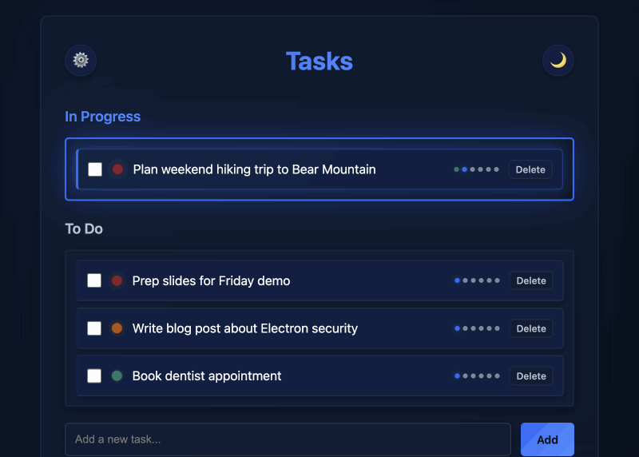

# InkDrift — To-Do App

[](https://github.com/mikeu66/Inkdrift/actions/workflows/test.yml)

A simple, dark-mode desktop to-do application built with Electron, with optional AI-assisted planning (Claude or local Ollama).



## Features

- Add, edit, and delete to-do items
- Check off completed tasks
- Inline editing with Save/Cancel buttons
- Planning page for each task with notes
- Priority levels (High/Medium/Low) with colored indicators
- In Progress section for actively worked-on tasks
- Mark tasks as "In Progress" from planning page
- Auto-sorting by priority and creation date
- Click any task to open detailed planning view
- Auto-save notes, priority, and status as you type
- Navigation with back button
- Visual priority system (🔴 red, 🟡 yellow, 🟢 green circles)
- Add new task input at bottom of list
- Keyboard shortcuts (Enter to save, Escape to cancel)
- Persistent storage (tasks saved locally)
- Dark mode UI
- Runs as a native Mac application
- AI features (brainstorming, plan generation, action items) with a choice of backend

## AI Provider

The AI features can run against either backend, selectable in Settings:

- **Anthropic Claude** (cloud) — requires an API key from [console.anthropic.com](https://console.anthropic.com/), stored encrypted via the OS keychain.
- **Ollama** (local, free) — no API key. Install from [ollama.com](https://ollama.com/), pull a model (e.g. `ollama pull llama3.2`), then pick it in Settings. Note: small local models (1–3B) produce noticeably simpler plans than Claude, and generation can be slow on CPU.

## Installation

```bash
npm install
```

## Running the App

```bash
npm start
```

## Building for macOS

```bash
npm run build
```

This will create a distributable .app file in the `dist` folder.

## Project Structure

```
To-do-app/
├── main.js            # Electron main process (storage, AI providers, IPC)
├── preload.js         # Context-isolated bridge between main and renderer
├── index.html         # Main UI
├── styles.css         # Dark mode styling
├── app.js             # Renderer: to-do logic and views
├── lib/               # Pure functions shared with tests (validation, parsing)
├── test/              # Unit tests (node:test)
├── benchmark/         # Ollama vs Claude comparison for the app's AI tasks
├── docs/              # Architecture notes and screenshot
├── package.json       # Dependencies
└── README.md          # This file
```

For a deeper walkthrough of the process model, storage, and security design, see [docs/ARCHITECTURE.md](docs/ARCHITECTURE.md).

## Testing

```bash
npm test
```

Runs the unit test suite (Node's built-in `node:test`, no extra dependencies) covering input validation and AI response parsing.

## Tech Stack

- Electron
- HTML/CSS/JavaScript (Vanilla)
- JSON file storage in Electron's userData directory, accessed via IPC (no direct filesystem access from the renderer)
- API keys encrypted at rest with Electron `safeStorage` (macOS Keychain)

## License

[MIT](LICENSE)
